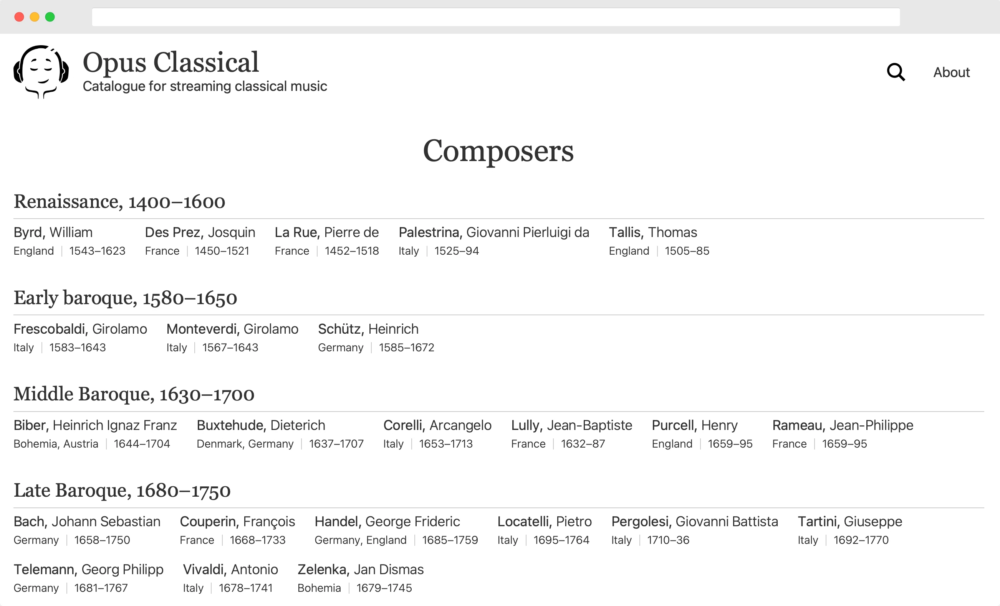

# Opus Classical

Curated catalogue of western classical music recordings. This version uses Go and Svelte.

[](https://github.com/Droidion/opus-classical-golang/actions/workflows/build.yml)



# How to run

Install:

- [The latest version of Go](https://go.dev/dl/).
- [LTS version of Node.js](https://nodejs.org/en/download/).
- [The latest version of pnpm](https://pnpm.io/installation).

Create `app.env` with appropriate environment variables:

```dotenv
# What port webserver runs on.
SERVER_PORT=8080
# Sentry.io DSN for submitting logs.
SENTRY_DSN=
# Postgres connection string.
DATABASE_CONNECTION_STRING=postgres://localhost:5432/opusclassical
# URI where covers reside.
COVERS_URI=https://opusclassical.zunh.nl-ams1.upcloudobjects.com/
# Content Security Policy HTTP header.
CSP="default-src 'none'; manifest-src 'self'; connect-src 'self' https://analytics.umami.is; script-src 'self' https://analytics.umami.is; style-src 'self'; img-src 'self' https://opusclassical.zunh.nl-ams1.upcloudobjects.com"
# URI for submitting client-side statustics with Umami.
UMAMI_URI=
# Website ID for submitting client-side statustics with Umami.
UMAMI_WEBSITE_ID=
# Is app run under development environment.
IS_DEV=true
```

Install packages:

- `$ pnpm i` for client-side.
- `$ go mod download`. for server-side.

Compile static assets:

- `$ pnpm run sass`
- `$ pnpm run build`

Build and run Go server

- `$ go run ./cmd/web`

Alternatively, build everything with `$ ./build.sh` and run server with `$ ./server`.

Alternatively, have Docker installed and run with `$ docker compose up`.

# Update packages

Look for new versions for:

- `$ pnpm outdated`.
- `$ go list -u -m -json all | go-mod-outdated -direct` (need [go-mod-outdated](https://github.com/psampaz/go-mod-outdated) installed).

Update `package.json` and `go.mod` respectively.

Download new versions:

- `$ pnpm i`.
- `$ go mod tidy`.

# Run unit tests

- `$ go test ./... -cover`

# Scripts Linting

Set up IDE to run eslint only, do not run prettier, because prettier is already set up as eslint rules.

- `$ pnpm run lint`

# Deploy

Opus Classical uses [render.com](https://render.com) for hosting. `main` branch automatically deploys to https://opusclassical.net